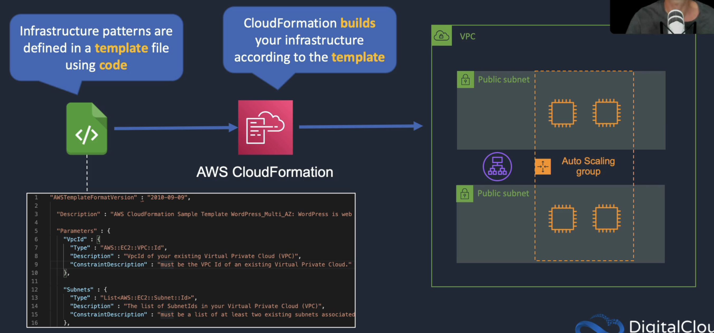

# AWS-SAA-C02

## Identity and Access Management (IAM)

Tipos de usuários:
 - com acesso a console AWS
 - não precisa acessar a console AWS, acessa de forma programática (AWS CLI). Necessário duas informações:
    - access key
    - security key
    
## ARCHITECT - Amazon Simple Storage Service (Amazon S3)
- Tiers
- Lifecycle
- cloud front (CDN - Content delivery network)
- Storage gateway - software para replicar dados de um data center em um bucket
   > https://docs.aws.amazon.com/pt_br/storagegateway/latest/userguide/StorageGatewayConcepts.html
  - File gateway (pictures, fotos, vídeos, docs) NFS
     - S3 Standard, Infrequent Access, Glacier
  - Volume gateway (OS, VM's) ISCSI - > snapshots
    - Arquitetura de volumes armazenados em cache
    - Arquitetura de volumes armazenados
  - Tape gateway (Backup de software vtl ) virtual VTL -> Glacier
- Snowball
  - Snowlball - dispositivo para fazer opload do armazenamento da empresa para Amazon s3
  - Snowball edge  - contém o um sistema EC2
  - Snow Mobile - 100 PB "caminhão container"
- S3 Transfer acceleration 
  - upload de arquivos a partir de edge location (cliente server)
- RRS - Reduced Redondancy Storage
  - armazena tipos de arquivos equivalentes thumbnail
  

## Elastic Public Cloud (EC2)

#### EBS - Elastic Block Store: tipos de volumes que permiete aptmizar o armazenamento

*Não é possível conectar um único EBS a duas instâncias EC2 ao mesmo tempo

- Tamanho fixo alocado
- Tipos de discos:
  - SSD
  - HDD
- Criar volumes
  - EC2 > Elastic Block Store > volumos > criar
- Snapshots
  - EC2 > Elastic Block Store > Snapshots > criar
  - EC2 > Elastic Block Store > Snapshots > create image 
- Lifecycle Manager - cria políticas para ciclos de backups

#### EFS - Elastic File System
- É possível conectar um EFS a uma ou mais instâncias EC2 ao mesmo tempo.
- Tamanho variável

#### User data EC2
cria instância e executa script somente a primeira vez que máquina iniciar

#### Estado de uma instância:
-  running
- stopped
- hibernate behavior (precisa habilitar na criação da instância)
  - volume EBS precisa ser encriptado 

#### AMI - Amazon Machine Image
Imagem virtual

#### EC2  Global Viel:
- Visualização geral de todas as máquinas em todas as Regions.

#### AWS Marketplace:
- Empresas ou pessoas físicas disponibilizam software no marketplace em instâncias EC2

#### Security Groups - Virtual firewall
- inbounds x outbounds
- stateful

#### Acessing Services - Acess Keys and IAM Roles
- Access Keys (não é o mais indicado por segurança): é configurado na instância EC2, é uma chave de acesso armazenada no sismtema de arquivo da instância.
- Intances Profiles (IAM Roles): A instância tem uma IAM Role associada, que contém as Policy de acesso.

#### EC2 Placement Groups
- cluster: packs instances close together inside an Availability zone. This strategy enables workloads to achieve the low-latency network performance necessary for tightly-coupled node-to-node communication that is typlical of HPC Applications
- Partition: spreads your instances across logical partition such that group of instances in one partition do not share de underlying hardware with groups of instances in diefferente partitions. This strategy is typically used by large distributed and replicated worloads, such as Hadoop, Cassandra, and Kafka
- spread: strictly  places a small group of instances across distinct underlying hardware to reduce correlated failures

#### ENIs Elastic Network Iterfaces
- ENI Elastic network interface: Basic adapter type when don't have any high-performance requirements, all type instances.
- ENA Elastic network adapter: Enhanced networking performance, High bandwith and lower inter-instance latency, choose supported instance.
- EFA Elastic fabric adapter: High Performance computing nad MPI and ML use cases, Tightly coupled applications, all type instances.
> EC2 > Elastic IP > Allocate
#### Public, Private and Elastic IP Addresses
- Public IP: is a dynamic address, cannot be remapped acrooss AZs
- Elastic IP: is a static address, Can be remapped acrooss AZs
- Private IP: Used in public and Private Subnets, retained when instance is stopped

#### Bastion Hosts
É uma forma de conectar em máquinas EC2 com ip privado dentro de uma VPC, para isso é usado uma instância com ip público com saída internet gateway. A conxão se dá acessando a instância pública que irá acessar a instância privada através do ip privado.

#### Amazon EC2 Princing Use Cases
- On-Demand: Small project for several hours, cannot be interrupted.
- Reserved: Steady-state, business critical, line-of-business apliccation, conitnuous demand.
- Scheduled Reserved: Reporting application, runs for 6 hours a day, 4 days per week.
- Spot Instances: Compute-intensive, const-sensitive distrubted computing, can withstand interruption.
- Dedicated Intances: Security-sensitive application, requires dedicated hardware; per-instance billing.
- Dedicated Hosts: Database with per-socker licensing.

#### AWS Nitro Sytem - Nitro Instances and Nitro Enclaves
Is the underlying plataform for the next generation of EC2 instances
- bare metal and virtualized instances
- Especialized hardware
- improves performance, security and innovation 

AWS Nitro Enclaves
- Isolated compute environments
- no persisitente storage, interactive access

## Elastic Load Balancing and Auto Scaling
### Elasticity: Escaling Up vc Out
- Scaling Up (Vertical scaling): means adding resources to the instance, add more hardware.
  - Limitation is that it has a single point of failure (SPOF)

Scaling Out (Horizontal scaling): add another instance of application, provides greater resiliency, can be used to add almost unlimited capacity.

### Amazon EC2 Auto Scaling
It launches and terminates instances dynamically
- Escalonamento Horizontal

Escala baseada em:
- CPU
- FILA
- SQS
- Rede
- Mem
- etc..

Suporta quais apps?
- Os dados não podem ficar no servidor
- segmentar para outros serviços (RDS, EFS etc)

Como Rotear o acesso?
- Utilizando ELB, balanceador de carga
  *Custo zero
  

  
#### Configuração:
- Launch Template: Specifies the EC2 instance configuration
- Launch Config: are replaced by launch templates an have fewer features

####  Health checks
- EC2: EC2 status checks
- ELB: Use the ElB health checks int addition to EC2 status checks
- Health check grace period
  - how long to wait berore checking the health status of the instance
  - Auto scaling does not act on heath checks unitl grace period expires

#### Monitoring
- Group metrics (ASG):
  - Data pints about the auto scaling group
  - Must be enabled
  - no charge
  - 1-minute granularity
- Basic monitoring (Instances): instances Sending metrics to CloudWatch
  - 5-minute granularity
  - no charge
- Detailed monitoring (Instances)
  - 1-minute granularity
  - Charges apply (it have to pay)
  

#### Addtional Scaling Settings
- Cooldowns: Used with simple scaling polici to prevent Auto scaling from laucnhing or terminating before effects of previus activities are visible.
  - Default value is 300 seconds (5 minutos)
- Termination Policy: Controls which instances to terminate first when a scale-in event occurs.
- Termination Protection: Prevents Auto scaling from terminating protected instances.
- Standby state - Used to put an instance in the InService state into the Standby state, pudate ou trobleshoot the instance
- Lifecycle Hooks - Used to  custom actions by pausing instances as the ASG launches or terminates them
 - Use case: run a script to download and install software after launching

### ELB - Elastic Load Balancer
Balanceador de carga
- Targets:
  - Instâncias
  - Container
  - Lambda

- Integra com Cert. Manager
- Faz Health Check

#### Types of ELB
- ##### ALB Application Load Balancer
  Layer 7, nível de aplicação precisa requests
  - Target Type: IP, Instance EC2, Lambda, ECS
  - HTTP, HTTPS
  - No Static IP address
  - HTTP header based
  - No privateLink support
  - Routing Target Group: 
    Are used to route requests to registered targets, it can be EC2 intances, IP addresses, lambda functions or containers
    > - requests can be routed based on the path in the URL
    > - Path-based routing: /example /public
    > - host-based routing: example.curso.com; public.curso.com
  - Query String Routing
- ##### NLB Network Load Balancer:
  Layer 4, camada de rede, high perfomance and veey low latency, TLS
  - Target Type: IP, Instance EC2
  - TCP, UDP, TLS
  - Static IP address
  - UDP listener
  - No HTTP Header based
  - PrivateLink support (TCP, TLS)
  - nodes routing Target Group: Targets can be EC2 instance or  IP addresses (can be outside a VPC a VPC - E.G. on-premises)
    >  - NLB nodes can have elastic IPs in each subnet
    >  - a separete listener on a unique port is required for routing: example:8080
    >  - requests are routed based on IP protocol data
  
- ##### CLB Classic Load Balancer: 
  Old generation; not recommened for new applications, layer 7 and 4.
- ##### GLB Gateway Load Balancer: 
  Layer 3 listens packets on all ports, used in front of virtual appliances such as firewalls, IDS/IPS

### Amazon EC2 Scaling Policies
- Dynamic Scaling 
  - Target Tracking: ASGAverageCPUUtilization
    - add new instance to average CPU utilization
  - Simple Scaling:
    - launch tow instances in the Auto Scaling Group
    - Wait 300 seconds before allowing another scaling activity
  - Step Scaling
    - launch tow instances in the Auto Scaling Group or more using de breach
  - Scheduled scaling
  
### Cross-Zone Load Balancing
is a feature os ELB which attemps to evenly distribute traffic to registered instances.
- (Enabled) Each load balancer node distributes traffic across the registered targets in all enabled Availability Zones.
  - ALB is always enabled
  - it divides equally in all the node availability zone
- (Disabled) Each load balancer node distributes traffic only across the registered targets in its Availability Zone.
  - NLB and GLB is disabled by default
  - it divides equally in the availability zone 
  
### Session state and Session Stickness
- Storing Session State store
  - User does not need to re-authenticate when instance fails
  - Session data retrieved from Database
  - ElasticCache is also a popular solution for storing session-state data
  
Sticky Sessions
  - Cookie is generated and client bound to instance for cookie lifetime
  - If an instance fails, session state is lost

### Secure listeners for ELB
- AWS ALB
  - ACM Certificate, can be generated by AWS Certificate
  - Encrypted client until Loadbalancer(SSL/TSL) and Unecrypted Load Balancer until EC2 
  - Or End to end encryption, Encrypted client until Load balancer(SSL/TSL) and Load balancer until EC2 (SSL/TSL Self-signed certificate)

- AWS NLB
  - Public certificate must be used
  - SSL/TLS on instance and connection all the way, Single encryptes connection
  - Oe SSL/TSL on Load Balancer and SSL/TSL on instance
  
## Block and File Storage

#### Block-based storage Systems (Elastic Block Store EBS)
- Hard disk drive (HDD)
- Can create volumes, it can be partitioned and formatted
- Block level
- EBS volume within a single availability zone
- It can't connect mulitiple instances in the same volume
- it persists indenpently of the life instance
- it does not need to be atacched to an instance
- Types EBS ssd-backed volumes:
  - gp (general purpose)
  - io (Provisioned IOPS SSD) iops(Input/Output per Second)
  - Throughput Optimized HDD
  - Cold HDD
- EBS volume data persists indepedently of the life of the instance
- EBS volumes do not need to be attached to an instance

### EBS Multi Attached
- it does allow connecting from multiple instances in the same A-Z
- Avaible for Nitro system-based instances

#### File-based storade systems (EFS)
- It is an implementation of file-based storage system NFS protococol, the Network File System
- Network Attached Storage
- The NAS "shares" filesystems over the network
- The OS sees a filesysten that is mapped to a local drive letter
- read and write data, it can't formart in OS
- it is only avialble for Linux instances
#### Object Storage Systems (S3)
- Obect storage container
- upload using HTTP Protocol
- There is no hieararchy

#### EBS Snapshots and DLM (Data Lifecycle Manager)
Tt is way that automate the backups

#### EBS vs instance store
Instance store volumes are physically attached to the host.
- it's extremely high performance
- Instance Store are ephemeral: data is lost when the instance powered down
- non-persistent
- caches, buggers and temporary storage

### RAID with EBS
RAID stands for redundant Array of independnet disks, it is  essentially a way that we can take multiple disks and aggregate them together

### Amazon Machine Images (AMIs)
it provides the information required to lounch an instance
- Community AMIs - free to use, generally for select the operating system
- AWS Marketplace AMIs - pay to use, generally come packaged with additional, licensed software

#### EC2 Image builder
it is free tool that can be used to create images, customize the software installed on them and secure images

#### Amazon FSx
It provides fully managed third-party file systems. There is tow file systems:
- Amazon FSx for windows
- Amazaon FSx for Lustre for compute-intensive workloads
  - Works natively with S3

#### AWS Storage Gateway
It is a service that enables you to connect you on-premises storage to AWS.
- File Gateway: a virtual on-premises file server
  - the file system is mounted using NFS or SMB
- Volume Gateway: 
  - Cached volume mode: a cache of the most recently used data on-premise and the entire data set is stored in S3
  - Stored volume mode: the entire data set is stored on-premise and data backed up as point-in-time snapshots
- Tape Gateway

#### AWS Backup
It is a service that can be used to create schedules for backing up multiple AWS resources

## AWS Organizations
is a service that enables us to create one organization for many AWS accounts.
- Available in two feature sets:
  - Consolidated Billing: Singgle bill in the main account, which is called the management account.
  - All features: 
    - Service Control Policies and tag policies
- includes root accounts and organizations units (Ornganizational container)
- Policies are applied to root accounts or OUs (SCP), control available permissions
- Consolidates billing includes:
  - Paying account: independent and cannot acess resources of other accounts
  - Linked Accounts: all linked accounts are independent
- Tag policy: Is the AWS Organization service that enforces tag standardization
- Organizations API: Can be used for migrating accounts but it wulde be easier to use the console for a singule account.
- AWS Organization console: move the account
## AWS WAF
Protects against DDoS Attacks and malicious Web Traffic.
- Atua na camanda 7 de aplicação
- Filtrar tráficos de origens (ex: países\)

## ECS - Amazon Elastic Container Service
Serviço de orquestração de containers
- Cluster EC2 ou Cluster AWS Fargate

Integra com:
- EC2
- IAM
- SM Security manager
- CW Cloud Watch
- ELB
- CI Devops

Task definitions ( Usado para configurar porta, autoscaling, ELB), pode ser feito com YAML.

#### Docker Containers vs Server Virtualization
- Every VM/instance needs an operating system wich uses significant resources
- hypevisor e VM vs Docker Engine and OS
- Each container is isolated form other containers
- A container includes all teh code, settings, and depedencies for running the application, and it can run on the same underlying operating system because of their isolatino
- Container is tiny in coparison to an entire virtual machine
- Container don't use a hug amount of processing power or memory because don't have that operating system in each container

#### Monolithic Application vs Microservices
- Monolithic application run all components in the same hoost(the user interface, business logic, and data access layer are combined on asingle pratform)
- On the microservices application all the compnents are separeted
- A microservice is iindependently deployable unit of code 
- Microservices are often loosely coupled
- Containers can also be spread across multiple underlying hosts
- Many instances of each microservice can run on each host

### ECS architecture

#### ECS Cluster
It is a logical grouping of tasks or services
#### Task
An ECS Task is a running Docker container
- It is craeted from a Task Definition: it config using Task Definition

#### Amazon Elastic Container Registry (AmazonECR)
It is a place where is registried images and can pull imagens over the internet ( Docker Uber is on example too)

#### ECS Services 
it is a way that can specify the number of tasks to run at any time
- An ECS Services are used to maintain a desired count of tasks

#### ECS Container instance
It is EC2 instance running the ECS agent (manage hosts, container hosts,)
- Two types of lounch type:
  - serverless(Fargate): where it doesn't see any container instances and doens't managem them
  - EC2 instances within your account: it is possible lounch manage, it has more operational control
  
#### ECS Key Feature
- Serverless with AWS Fargate: managed for you and fully scalable
- Fully managed container orchestration: control plane is managed for you
- Docker suport: run and manage docker containers with integration into the Docker compose CLI
- Elastic Load Balancing integration -distribute traffic across containers using ALB or NLB
- Amazon ECS Anywhere(NEW): enables the use of Amazon ECS control plane to manage on-premises implementations

#### Launch Types
- EC2: Container instances are Amazon EC2 instances running in your account 
  > ECS EC2 Cluster > EC2 Service > ECS container instance
  - Explicity provision EC2 instances
  - You are responsible for managing EC2 instances
  - Charged per runnint EC2 instance
  - Docker volumes, EFS, and ESx for Windows  File Server
  - You handle cluster optimiztion
  - More granular control over infrastructuring
- Fargate
  > ECS Fargate Cluster > ECS Service > Task
  - Fargate automatically provisions resouces 
  - Fargate provisions and manages compute
  - charged for running tasks
  - EFS integration
  - Fargate handles cluster optimization
  - limited control, infrastructure is automated
  
#### ECS and IAM Roles
ECS Cluster: 
  - IAM instance Role (stay inside of ECS Container Service), The container instance IAM role provides permissions to the host.
    - It provides the permissions which the container needs
    
  - IAM Task Role ( It assigned to the task), it provides permissions to the container instance, not to the host.
  
  - Container instances have access to all of the permissions that are supplied to the container instance role through instance metadata
    >   OBS: Permissions assigned to the instance role are also supplied to the tasks that are running on top of the instance

ECS Fargate:
  - IAM Task role: with the Fargate launch type only IAM task roles can be applied
  - Task roles are defined in the task defintion or in the run task API

#### Scaling Amazon ECS
There is two types of scaling:
  - Service auto scaling: Service automactically adjusts the desired task count up ou down using the Application Auto Scaling service
    - supports target tracking, step, and scheduled scaling policies 
    - Suports the following types of scaling policies:
      - Target Tracking Scaling policies: Increase or decrease the number of tasks that your service runs bases on a target value for a epecific CloudWatch metric
      - Step Scaling Policies: incriease or decrease the number of tasks that your service runs in response to CloudWatch. Step scaling is based on a set of scaling adjustments, known as step adustiments, which vary based on the size of the alarm breach
      - Scheduled Scaling: increase or decrase the number of tasks that your service runs based on the date and time
        
  - Cluster auto scaling: uses a Capacity Provider to scale the number of EC2 cluster instances using EC2 Auto Scaling
    - Uses an ECS resource type called a Capacity Provider
    - A Capacity Provider can be associated with an EC2 Auto Scaling Group (ASG)
    - ASG can automatically scale using:
      - Managed scaling: with an automatically-created scaling policy on your ASG
      - managed instance termination protection: which enables container-aware termination of instances in the ASG when scale-in happens

#### ECS with Applicaton load balance(ALB)
- Dynamic port is allocated ont the host
- Each task can be running a webservice at the same port
- All connections to webservices comming into HTTP listener (port 80), but then, they are getting distributed to the host ports, and then when tehi come in on a specific host port, the container instance knows which container it.
OBS: if we have our containers runnig in a private subnet, we should have NAT gateway in a public subnet and an aentry in the route table for the private subnet
  - NAT gateway required for tasks in private subnets to access the internet
  
#### Amazon Elastic Kubernetes Service (EKS)
It is a managed service for running kubernetes applications in the cloud or on-premises
- Kubernetes is an open-source system for automating deployment, scaling, and management of containerized applications
- EKS is used when you need standardize container orachestration across multiple environments using a managed Kubernetes implementation
- Features:
  - Hybrid deployment: manage Kubernetes clusters and applications across hybid environments (AWS + On-premises)
  - Batch processing: run sequential or parallel batch workloads on your EKS cluster using Kubernetes Jobs API. Plan, schedule and execute batch workloads
  - Machine Learning: use Kubeflow with EKS to model your machine learning workflows and efficiently run distributed training jobs using the latest EC2 GPU-powered instances, including inferentia
  
- Managed Kubernetes Service: runs on EC2/ Fargate and also AWS Outposts
> Region > VPC > Availabilty Zones (public subnet) > ECS Cluster > EKS Control Plane & Worker Nodes

- EKS Supports load balancing with ALB, NLB, CLB
- Groups of containers are known as Pods in Kubernetes
- Cluster Auto Scaling Details:
  - Vertical Pod Autoscaler: automatically adjusts the CPU and memory reservations for your pods
  - Horizontal Pod Autoscaler: automcatically scales the number of pods in a deployment, eplicaton controller, or replica set based on that resource's CPU utilization

Workload Auto Scaling Details:
- Amazon EKS supports two autoscaling products:
  - Kubernetes Cluster Autoscaler: use AWS scaling groups
  - Karpenter open souce autoscaling project: works directly with the Amazon EC2 fleet
  
Amazon EKS Elastic Load Balancing
- The AWS Load Balancer Controller manages AWS Elastic Load Balancrs for a Kubernetes cluster
- Install the AWS Load Balancer Controller using Helm V3 or later or by applying a Kubernetes manifest
- The controller provisions the following resources:
  - An AWS Applicaton Load Balancer (ALB) when you create a Kubernetes Ingress
  - An AWS Network Load Balancer (NLB) when you create a Kubernetes service of type LoadBalancer
  
Amazon EKS Distro:
  - it is a destibution of Kubernetes with the same dependencies as Amazon EKS
  - Allows you to manually run Kubernetes clsters anywhere
  - includes binaries and containers of open-source Kubernetes, etcd, networking, and storage plugins, tested for compatibility
  - You can securely access EKS Distro releases as open source on GitHub or within AWS via Amazon S3 and Amazon ECR
  
Amazon ECS and EKS Anywhere:
- Run ECS or EKS on costumer-managed infrastructure, supported by AWS
- Customers can run Amazon ECS/EKS Anywhere on their own on-premises infrastructure on bare metal servers
- Or you can also deploy ECS/EKS Anywhere using VMware vSphere

#### Amazon Elastic Container Registry (ECS)
- It is a fully-managed container registry
- Integrated with Amazon ECS and Amazon EKS
- Supports Onpen Container Initiative(OCI) and Docker Registry HTTP API V2 standards
- It can be accessed from any Docker environment - in the cloud, on-premises or on you machine
- Container images and arifacts are stored in S3

#### Amazon App Runner
it is a Fully managed service for deploying containerized web app and APIs.
> aws apprunner create-service --service-name my-simple-service --source-configuration (Github Repo or ECR Registry(image))

- PaaS solution with all components managed - just bring your cod and container image

## AWS Cloud Trail
- Trilhas de logs
- Possibilita automação
- tudo, tudo e tudo
- Regional (mas da para gerar global)
- Integra com Cloud Watch (log, metrics, alert)

## AWS Database
Relacional (RDS - Relational database service)
- Mulit AZ -> ex: Disaster Recovery
  - ex: Duas DB idênticas em duas ou mais AZ, mesmo DNS
  
        Amazon RDS > databases > modify > multi-AZ deployment

- Read Replica -> cópia idêntica
  - Duas DB com DNS diferente, inserção manual na réplica
  - backup enabled
  
        Amazon RDS > databases > actions > create read replica

Backups:
- Automated: 1 - 35 dias - > S3 (free)
  - Amazon RDS > databases > modify > backup
- DB snapshot: manual 
  - Amazon RDS > actions > take snapshot --> snapshots
 
### Amazon RDS
It is a relational database that runs on EC2 instances, so it must choose an instance type
- Use EC2 instances
- Relational databases
- RDS is OLTP(Online Transaction Processing) type of database
- highly avilable, fault tolerant and scalable
- Commum use cases include stores and banking systems
- Encrypt Amazon RDS instances and snapshots
  - It uses AWS Key mangement Service (KMS)
RDS suports
- Amazon Aurora
- MySQL
- MariaDB
- Oracle
- SQL Server
- Postgres

#### Amazon RDS Scaling Up (Vertically)
It is when we change our instance type (db.m4.large to > db.m4.2xlarge)
#### Disaster Recovery(DR) and Scaling Out (Horizontally)
- High availability
- Fault tolerance

- #### Multi-AZ
  It creates a passive standby Primarily used for disaster recovery (DR)
  - RDS Master > primary database
  - RDS Standby > Synchrnous replication, always in sync with the master

- #### RDS Read Replica
  RDS Read Replica > Asynchronous replication, there is a little more delay
  - It is used for scaling database queries (reads) (escalonar leituras), it means scaling the queries(consulta) on your data base
  - All writes (Records) are going to master, but reads can instead go the read replica so thate we can scale

#### Amazon RDS Automated Backups
- Backs up the entire DB instance, not just individual databases
- For single-AZ DB instances there is a brief suspention
- For Multi-AZ SQL Server, I/O activity is briefly suspended on primary
- For Multi-AZ MariaDB, MySQL, Oracle and PostgreSQL the snaphot is taken from standby
- Snapshots do not expire(no retention period)

#### Amazon RDS Security
- RDS SG
- SSL/TLS encryption in-transit
- RDS encryption at rest AES 256-bit encryption (repouso)
  - incluedes DB storage, backups, read replicas and snaphots
- it can only enable encryption for an Amazon RDS DB instance when you creat it, not after DB instance is created
- Uses AES 256 encryption and encryption is transparent with minimal performance impact
- AWS KMS is used for managing encryption keys
- DB instances that are encrypted can't be modified to disable encryption
- The read replica will always have the same encryption status as the primary

- How to do an unencrypted to be encrypted? copy a snapshot(EBS Volume unencrypted) to copy a snapshot(encrypted) and run a new RDS instance encrypted with new endpoint

#### Aurora
It has two differente engines, Mysql or postgres
- It is up to five times faster than standard MySQL databases and three times faster than standard PostgreSQL databases
- it is distributed, fault-tolerant, self-healing storage system that auto-scales upt ot 129TB
- Aurora replicas are within a region, it can be in diferrent availability zones, but they are always within a region
- Aurora Fault Tolerance
  - Fault tolerance across 3AZs
  - Single logical volume
  - scale-out read requests
  - can promote Aurora replica to be new primary or create new primary
  - can use Auto Scaling to add replicas
- Key Features  
  
- Amazon Aurora Replicas
  
- Deployment Options with Amazon Aurora
  
  
- Cross-Region with Aurora Mysql
  
  
- Aurora Global Database
  
- Aurora Serveless
  - Infrequently used application
  - New applications (who don't know about performance)
  - Variable workloads - performance profile is very variable
  - Unpredictable workloads
  - Development and test databases
  - Multi-tenant applications
  
- criada 2014
- compatibilidade com mysql oracle
- 5x Faster
- 10x barata
- Default 10gb -> autoscaling automatico (646GB) -> 64TB
- criação de replicas (read) x15
- Recover -> Point in-time
- Backup continuo -> 3 zonas

#### Amazon RDS Proxy
- It is a fully managed database proxy for RDS
- Highly available across multiple AZs
- Icreases Scalability, fault tolerance, and security
- Commom use: Serveless, lambdas functions that are scaling independently
  - Connection Pool
  - Reduces stress on CPU/MEM
  - Shares infrequently used connections
  - Drives increased effec
  - Control authentication methods
  
#### Amazon RDS Anti-Patterns and Alternatives
if we're presented with some requirements for a database of some sort, when would we ot use RDS?
- When NOT use Amazon RDS (Anti-patterns)
  - Anytime you need a DB Type other than:
    - MySQL
    - MariaDB
    - SQL Server
    - Oracle
    - PostgreSQL
    
  - you need root acess to the OS
  

    
### Amazon ElasticCache

- Rápido, latência baixa (criação, operação e escalabidade)
- Não utiliza disco
- Armazenamento em processamento e memória (in-memory cache)
- Ex: Web site e-commerce(acessos simultâneos ao mesmo produtos)
- Tipos:
  - Memory cached: armazena no bd relacionado a objetos
  - Redis: key-value and Multi-AZ
  
It is a in-memory database and is often used for caching data that comes for other databases
- Fully managed implementations Redis and Memcached
- It is a key/value store
- In-memory database offering high performance and low latency
- ElastiCache node run on Amazon EC2 instances, you you most choose an instance family/type

- Redis vs Memcached:
  
  
- Use cases:
  
  

#### Escalability
- Memcached 
  - add nodes to a cluster
  - Scale vertically (node type) - must create a new cluster manually
  
- Redis Cluster mode disabled
  - add replica or change node type - creates a new cluster and migrates
  - each node is a partition of data
  - ** Single shard (node group) with one primary node and up to 5 read replica
 - Cluster mode enabled
  - Online resharding to add or remove shards; vertical scaling to change node type
  - Offline resharding to add or remove shards change nnode type or upgrade engine(more fexible than online)
  - ** Cluster mode enables replication across multiple chards for enhanced scalability and availability

### Dynamo DB
Amazon DynamoDB is AWS's serverless NoSQL
- Key/value store documento store
- It is a schema-less NoSQL taht provides push-button scaling
- It is a non-relational, key-value type of database
- Fully serveless service
- Push button scaling
- It is made up of:
  - Tables
  - items
  - Atributes
- Time to Live (TTL)
 - It lets you define when items in a teble expire so that they can be automatically deleted from the database
  - With TTL enabled on a table, you can set a timestamp for deletion on a per-iten basis
    
Table structure

Benefits

#### DynamoDB Streams

#### DinamoDB Accelerator (DAX)
- Dax is a fully managed, highly available, `in-memory` cache for DynamoDB
- Improves performance from milliseconds to microseconds
- Can be a read-through cache and a write-through cache
- Used to improve `READ` and `WRITE` performance
- It doesn't need to modify application logs, since DAX is compatible with existing DynamoDB API calls

 

#### DAX vs ElastiCache
- DAX is `optimized` for DynamoDB
- With ElastiCache you have more mangement overhead (e.g. invalidation of the cache)
- With ElatiCache you need to modify application code to point to cache
- ElatiCache suports more datastores

#### DynamoDB Global Tables
It is where we have multiple regions and we can actually deploy DynaomDB in a region and then have DynamoDB in multiple other regions and we-re able to read and write to those regions.

> - Latência baixa (milisegundos)
> - Documentos -> key value
> - APP Web/ mobile/ games
> - SSD
> - Armazenamento em 3 ou mais data centers
> - Consistent Reads x Strongly consistent reads
>   - Consistent Reads: Write/read maior que 1 segundo
>   - Strongly consistent reads: Write/read menor que 1 segundo

  
### Redshift
-Amazon Redishift is a fast, fully managed data ware house
- Analyze data using standard SQL and existing Business Intellingence (BI) tols
- It is a SQL based data warehouse used for analytics applications
- It is a `relational database` that is used for Online Analytics Processing(OLAP) use cases
- It uses `EC2 instances`, so you must choose an instance family/type
- Always keeps three copies of your data

#### OLTP vs OLAP

#### Reporting and Analytics Use Cases
For simple use cases, iit is better use Read replica. If the situation is multi-zones with additional geographies and date bases, It is better Redishift

#### Data Sources

> - Warehouse (armazem) ex: Toyota, Amazon
> - Armazenamento em colunas (leitura em colunas)
> - 1 datbase inicia com 160GB
> - Compressão de dados
> - Tipos:
>  - Single mode -> 1 instância DB
>  - Compute mode -> 128 instâncias de DB
> - MPP: Massively Parallel Processing -> Leitura em várias DB ao mesmo tempo  
> - Não é Multi-AZ

### Amazon Elatic Map Reduce (EMR)
Managed cluster plataform that simplifies running big data frameworks including Apache Hadoop and Apache Spark
- It is used for analytics big data and business intelligence 
- It is used for processing data `big data` for analytics and business intelligence
- It can also be used for transforming and mobing large amounts of data
- Perfrms extract, transform, and load (ETL) functions
- Always runs in an availabilty Zone

### Amazon Kinesis Services
It's about streaming data
- `Data analytics` process data streams
- `Data Firehose` loads data straight to destinations
- PUT 1000 records per second

#### Amazon Kinesis data stream

#### Kinesis Client Library (KCL)
It helps you consume and process data from a Kinesis data stream
- KCL `enumerates shards` and insantiates a `record processor` for each shard it manages
- It runs on EC2 instance
- `KCL Worker` with multiple record processors
- Each shard is processed by exactly on KCL worker and has exactly one corresponding record processor
- A `record processor` maps to exactly one `shard`

#### Kinesis Data Firehose
- Producers send data to Firehose
- There aren o `Shards`, completely automated (scalabiltiy is elastic)
  - OBS: With Kinesis streams we need actually add the correct number of shards to handle the amount of data that is being put through the Kinesis data stream
  
- It is sent to another AWS service for storing, data can be optionally processed/transformed using AWS Lambda

#### Kinesis Data Analytics
- Provides real-time SQL processing for streaming data
- Provides analytics for data coming in from Kinesis Data Streams and Kinesis Data Firehose
- Destinations can be Kinesis Data Streams, Kinesis Data Firehose, or AWS Lambda

> Responsável por coletar, armazenar e analizar dados de streaming para serem analisados ou utilizados por outra aplicações. Armazena em shad(partes).
> - Streams: recebe os dados e armazena para que depois outros serviços possam consumi-los.
> - Firehose: recebe os dados, mas não armazena, apenas processa ou deixa que outro serviço o faça.
> - Analytics: faz a análise dentro do Streams e do Firehose.

### Amazon Athena and AWS Glue
#### Amazon Athena
It is a serveless service that can be used to run SQL queries against dta
- Athena queries data in S3 using SQL
- Can be connected to other data sources with Lambda
- Uses a managed Data Catalog (AWS Glue) to store iniformation and shemas about data and tables

- #### Optimizing Athena for Performance
  - Partition your data
  - Bucket your data - bucket the data within a single partition
  - Use Compression - AWS recommend using either Apache Parquet or Apache ORC
  - Optimze files size
  - Optimize columnar data store generation
  - Optimize ORDER BY and GROUP BY
  - Use approximate functions
  - Only include the collumns that you need
#### AWS Glue
- Fully managed, transform and load(ETL) service
- Used for preparting data for analytics
- It runs the ETL jobs on a fully managed, scale-out Apacha Spark environment
- It Discores data and stores the associated metadata int the AWS Glue Data Catalog
- Works with data lakes(data on S3), data warehouses(including RedShift), and ata stores (including RDS or EC2 databases)
- It is used as a `metadata catalog` (can also use Apache Hive)
- You can use `crawler` to populate the AWS Glue Data Catalog with tables 
 
### Amazon OpenSearch Service (Elaticsearch)
It is a fully managed service that can be used for searching, visualizing and analyzing text and unstructed data
- Successor to Amazon Elastic Search Service
- Distributed and analytics suite
- Based on the popular open source Elasticsearch
- Supports queries using SQL syntax
- Integrate with open-source tools
- Scale by assing or removing instances
- Availability in up to three availability Zones

#### OpenSearch Service Deployment
- Clusters are created (Console, API, or CLI)
- Clusters are also known as OpenSearch Service `domains`

#### Ingesting Data into Open Service domains

#### Open Search in an Amazon VPC
- Clusters can be deplyed in a VPC for secure intra-VPC communications
- VPN or proxy required to connect from the internet (public domains are directly acessible)
- Limitations of VPC deployments
  - you can't switch from VPC to a public endpoint, The reverse is also true
  - you can't launch your domain within a VPC that uses dedicated tenancy
  - After you place a domain within a VPC, you can't move it to a different VPC, but you can change the subnets and security group settings

#### THE ELK Stack
- ElK stands for Elasticsearch >  Logstash < and Kibana
- this is a popular combination of projects
- Aggregate logs from systems and applications, analyze these logs, and create vizualizations

#### OpenSerach Access Control
- `Resource-based policies` - Often called a domain access policy
- `Identity-based policies` - attached to users or roles (principals)
- `IP-based policies` - Restrict access to one or more IP addresses or CIDR blocks
- `Fine-grained access contro` - Provides"
  - Role-based acess control
  - Security at the index, document, and field level
  - OpenSearch dashboards multi-tenancy
  - HTTP basic authenticatio for OpenSearch and OpenSearch Dashboards

#### OpenSearch Best Practices
- Deploy OpenSearch data instances across three Availability Zones(AZs) for the best availability
- Provision instances in multiples of three for equa distribution across AZs
- If three AZs are not available use two AZs with equal numbers of instances
- Use three dedicated master nodes
- Configure at least one replica for each index
- Apply restrictive resource-based access policies to the domain ( or use fine-grained acess control)
- Create the domain within an Amazon VPC
- For sensitive data enable node-to-node encryption and encryption at rest

### Amazon DocumentDB
- Amazon Document DB provides MongoDB compatibility
- It is a database service that is purpose-built for JSON data management at scale
- Fully managed service
- Storage scales automatically upt to 64 TB without any impact to you application

### Amazon Keyspaces (for Apache Cassandra)
- A scalable, highly available, and manged Apache Cassandra-compatible database service
- it enables yout to use the Cassandra Query Language API code
- Keyspaces is serverless and fully manged
- Scales automatically in response to application traffic

### Amazon Nepture
- Fully managed graph database service
- Build and run indentity, knowledge, fraud graph, and other applications
- Deploy high performance graph applications using popular open-source APIs including:
  - Gremlin
  - openCypher
  - SPARQL
  
### Amazon Quantum Ledger Database
- Amazon QLDB is a fully managed ledger database that provides a transparent, immutable, and cryptographically verifiable transaction log
- It has a built-in immutable journal that stores an accurate and sequenced entry of every data change
- The journal is append-only, meaning that data can only be added to a journal, and it cannot be overwritten or deleted
- It uses cryptography to create a concise summary of your change history
- Generated using cryptographic hash fucntion (SHA-256)
- Serveless and offers automatic scalability

### Other Analytics Services
### Amazon Timestream
Time series database service for IoT and operational applications
- faster and cheaper than relational databases
- Keeps recent data in memory and moves historical data to acost optimezed stored tier based upon use defined policies
- Serverless and scales automatically

### AWS DATA Exchange
It is a data marketplace with over 3,000 products from 250+ providers 
- It suports Data Files, Data Tables, and Data APIs
- Consume directly into data lakes, applications, analytics, and machine learning models
- Automatically export new or updated data sets to Amazon S3
- Query data tables with AWS Data Exchange for Amazon Reshift

### AWS Data Pipeline
It is a managed ETL (Extract-Transform-Load) Service
- Process and move data between different AWS compute and storage services
- Data sources can be on-premises
- Data can be processed and transformed
- Results can be loaded to services such as Amazon S3, Amazon RDS, Amazon DynamoDB, and Amazon EMR

### Data Lake
#### What is a Data Lake?
A data lake is a centralized repository that allows you to store all your structured and unstructured data at any scale

#### Data Lake vs Data Ware House

### AWS Lake Formation
It enables yout to set up secure data lakes in days
- Data can be collected from databases and object storage
- It is saved to the Amazon S3 data lake
- You can then clean and classify data using ML algorithms

### Amazon Managed Streaming for Apache Kafka (MSK)
It is used for ingesting and processing streaming data in real-time,
- it is similiar to Kinesis, but Apache Kafka is a open source project rather than Kinesis, which is a especific
- Build and run Apache Kafka applications
- It is a fully managed service
- Provisions, configures, and maintains Apache kafka clusters and Apache ZooKeeper nodes
## Route53
Serviço AWS para AWS, responsável pelas resoluções de endereçamento IP.
- Redundância de localização: replicado para todas locations
- 100% SLA (availabilty)
- GEO Location, Failover 

#### DNS Records (Registros)
- HOST A (A -IPV4 ou AAAA - IPV6): amazon.com -> 1.1.1.1
- Alias (Cname): *cursos*.amazon.com -> 1.1.1.2
- Mail exchange (MX): Email (server), utiliza prioridade 
- Service Record (SRV): qual serviço está rodando? target(IP)? porta? Prioridade?
- Start of Authority(SOA): Primary NS
- Name Server (NS): Armazena Start of Authority
- POinter (PTR): Constrário do Host, dado um IP converte no Domínio DNS

### Routing Policies
Health check
- #### Simple Routing
  Uma requisição de DNS para cada servidor, envia randomicamente o endereçamento IP para o HOST

- #### Failover Routing
  Quando um servidor falhar redirecionar para outro

- #### Geolocation Routing
  Rotear pra uma Region a partir de uma localização

- #### Geoproximity Routing(Traffic Flow Only)
  Traffic flow: idêntifica onde o tráfico está passando aplicando políticas para esse tráfico, baseado em aproximação de geolocation

- #### Latency-based Routing
  Redirecionamento feito a partir da menor latência, acessando os servidores mais próximos, ELB

- #### Multivalue Answer Routing
  Simple check with Health check

- #### Weighted Routing
  - Peso de tráfego que está sendo enviado para cada servidor
  
### Amazon Route 53 Resolver
It's essentially about making sure that either EC2 instances or clients in your on-premises data center are able to reslove records in both your on-promises DNS server database.
  - Outbound Endpoint
  - Inbound Endpoint

### Amazon CloudFront 
- CloudFront origins and Distributions 
- CloudFront caching and behaviors 
  - Regional Edge Caches
  - Decreasing the TTL(Time to live) is best for dynamic content, increasing TTL is better for performance(and reduces load on origin)

### Signed URLs 
- Signed URs provide more control over access to content
- Can specify beginning and expiration date and time, IP addresses/ranges of users
- Signed URLs should be used for individual files and clients that don't support cookies
- Only it is used for a single object
### Signed Cookies
- Similiar to Signed URLs
- Use signed cookies when you don't want to change URLs
- It is used for multiple objects 
### Origin Access Identities(OAIs)
- is used with S3, it's not used with EC2

### SS/TLS and SNI (Server Name Indication)
SNI is a method where able to have multiple SSL/TLS certificates which correspond with different domain names running on the same IP address on CloudFront.
 - Multiple certificates share the same IP with SNI

### Lambda@Edge
it allows to run Node.js and python Lambda functions to customize the content CloudFront delivers
- Executes functions closer to ther viewer

### AWS Global Accelerator 
It is a networking service that allows to utilize the AWS Global Network to send data to your applications. It means that you are avoiding the internet for a large parth of the data transfer
- Better bandwith and latency
- consistency 

## Virtual private cloud (VPC)
    default VPC X Custom VPC
Conceitos importantes:
- VPC PEERING - conectar VPC com outra VPC
- No TRANSIT entre VPCs: permite apenas conexão direta
- ACL -> stateless - Deny && Allow
- SEC GROUPS -> stateful - apenas Allow
- It's region wide
> https://medium.com/awesome-cloud/aws-difference-between-security-groups-and-network-acls-adc632ea29ae#:~:text=Security%20groups%20are%20tied%20to,assigned%20explicitly%20to%20the%20instance.

Fluxo até internet Gateway
> Subnet > ACL > Routing Table > Router > Internet Gateway

Router
> Routers interconnect subnets and direct traffic between Internet gateways, virtual private gateways, NAT gateways and subnets
### NAT - Network address translation
Roteador que tem um enderaçamento privado e um endereço público, serve para transcrever um ip privado para um ip público de forma que este tenha acesso a rede.

- Nat instance: dispositivo criado como um servidor EC2, sem escalabilidade
  > Cria uma instância EC2 do tipo Nat que será associada a uma rota de saída para uma route table.
  > requires the source and destination checks to be disabled
- Nat gateway: como um aplicação, mais confiavel
 > VPC > Nat gateway - Create
> Nat gateway é criado em uma subnet publica
### NACL
- In bound
- Out bound
- apply at the sybnet level

### Sercurity Group
- Instance level, network interface level
- it can be applied to instances in any subnet

### Stateful vs Stateless Firewalls
- stateful firewall allows the return traffic automatically 
  - thers is an implicit deny rule at the end of the ruleset
  - Security group is a stateful firewall
- stateless firewall checks for an allow role for both connections (inbound rule and outbound rule)
  - it has an explicit deny  
  - network CAL is a stateless firewall
### VPC Flow Logs
VPC > actions > create flow log

### Bations Hosts (Jump Box)
Servido que fica dentro da tupologia, sendo o único que tenha acesso a internet. É através desse host que será acessado as outras instâncias da rede.

### Direct Connect
Roteadores da Amazon que conectam diretamente com a nuvem da AWS e fazem conexão diretamente com uma provedora de telecom (internet).

### VPC Peering
> VPC > peering connections > Create peering connection

### VPC EndPoint
Cria uma ponte entre a VPC e os serviços AWS, ou seja, uma máquina dentro de uma VPC sem acesso a internet consegue acessar os recursos da AWS. 
- Interface endpoint (ENI): Elatic Netword Interface with a Private IP
  - Use DNS entries to redirect traffic
  - Which Services: API Gateway, CloudFormation, CloudWatch etc.
  - Security Groups
  - each interface endoint can connect to one of many AWS services using private IP
  
- Gateway endpoint: A gateway that is a target for a specific route:
  - Use previx lists in the route table to redirect traffic
  - It can be connected with  Amazon S3 and DynamoDB only
  - VPC Endpoint Policies
  - example:
  > - (S3 Gateway endpoint) user route table, it has to put a route table entry to point aour traffic to the S3 Gateway endpoint
  > - IAM policies can be applied to endpoints
  > - Bucket policies can limit access to endpoint source
> VPC > Endpoint > create

### AWS Cliente VPN
Client VPN Network interfaces created in subnet

### AWS Site-to Site VPN
AWS VPN is a managed IPSec VPN
- Use Virtual private Gateway (VGW): It is deployed on the AWS site
- Customer gateway is deployed on the customer side
- Supports static routes or BGP peering/routing
- Route tables points to the VGW

### AWS VPN CloudHub
Is a pattern and architectural pattern that you can use when use it.
- it implemented a VGW: It is deployed on the AWS site
- Remote offices connect to the VGW in a hub-and-spoke model
- AWS is the hub, the VPC, and the spokes go out to each of these offices
- Each of these customers must use a unique Border Gateway Protocol Autonomous Sytem number (BSG ASN)
- Network traffic may go between a VPC and a remote office

### AWS Direct Connect (DX)
It is not  shared, it's not public, it's dedicated.
> - Private connectivity between AWS and data center/office.
> - DX Conncetions are NOT encrypted! Use IPSec SWS VPN connection over a VIF to add encryption in transit
> - Consistent network expirence - increased speed/latency & bandwidth/throughput
> - Lower costs for organizzations that transfer large volumes of data
- It has AWS Direct Connect location
- AWS cage: rack with all equipaments 
  - AWS Direct Connect endpoint
- Customer/partner cage: rack with equipaments
  - Customer/partner router
- A Dx port must be allocated in a DX location
- A cross-connect between the AWS DX router and the customer/partiner DX router
- Private VIF (virtual private gateway) connects to a single VPC in the same AWS Region using VGW.
- Public VIF can be used to connect to AWS Public services in any Region(but not the internet)
- Multiple Private VIFs can be used to connect to multiple VPCs in the Region

#### AWS Direct Connect Gateway
DX Gateway connect to multile regions, a Private VIF is associated with the DX Gateway and then the DX Gateway is associated with VGW
- Network traffic can be routed from on-premises to any VPC
- DX Gateway does not allow VGWs to send traffic to each other Region

#### AWS Transit Gateway
It is cloud router and it connects VPCs and on-premises locations together using a central hub.
- Transit Gateway is a network transit hub that interconnects VPCs and on-promeises networks
- Specify one subet from each AZ to enable routing within the AZ
- VPCs are attached to Transit Gateway

### VPC Flow Logs
It capture information about the IP traffic going to and from network interfaces in a VPC.
- It can be created at the following levels:
  - VPC
  - Subnet
  - Network interface
 
## Architect - Aplicações AWS

### Simple Workflow Service
Conjunto de tarefas que devem ser executadas em uma ordem específica. Gerencia o workflow tasks de um sistema.
- Pode se extender até 10000 mil tarefas
- Faz por volta de 1000 por segundo

### Elastic Transcoder
Converte mídias para formatos específicos (MP4,MP3,HD).

### Cognito
Web Identity Federation, permitir ou bloquear acesso de acordo com uma credencial que não está armazenada na aplicação.
- User Pool: Retorna autenticação do User.
- Identity Pool: Retorna o que pode ou não pode acessar

## Serverless  
- "Sem servidor"
- Scaling por conta da AWS
- Pricing:
  - 1 Milion Requests = FREE
  - 0,20R$ por cada 1M de requisições
  > https://aws.amazon.com/pt/lambda/pricing/
  
### Serverless Services and Event-Driven Architecture
Serverless is a concept in which it doesnt't manage the underlying servers
- Event-driven architecture is an architectural pattern. it leverages technology where it has an event happen in one service that then triggers something that rappens in another service
- With serverless there are no instances to manage
- It doesn't need to provision hardware
- There is no management of operating system or software
- Capacity provisioning and patching is handled automatically
- Provides automatic scaling and high availability
- it can be very cheap

### AWS Lambda
It is AWS serverless compute service, and it's a service that we can use in event driven architectures for running code based on triggers.
- Event occurs: Source can be CLI, API, SDK or a trigger
- Lambda functions have a maximum exectuion time of 15 minutes
  - It run if you have code that needs to run for a relatively short period of time, less then 50 minutes or maybe just a few seconds
- AWS Lambda executes code only when needed and scales automatically
- You pay only for the compute time you consume (you pay nothing when your code is not running)
- Benefits of AWS Lambda:
  - No servers to manage
  - Continuous scaling
  - Millisecond billing
  - Integrates with almost all other AWS services
  
- Primary use cases for AWS Lambda:
  - Data processing
  - Real-time file processing
  - Real-time stream processing
  - Build serverlesss backend for web, mobile, IOT, and 3rd party API requests
  
#### Lambda Fucntion Invocations
- Synchronous:
  - CLI, SDK, API Gateway
  - Wait for the function to process the envent and return response
  - Erro handling happens client side (retries, exponential backoff etc)
- Asynchronous:
  - S3, SNS, CloudWatch Events etc.
  - Event is queued for processing and a response is returned immediately
  - Lambda retries up to 3 times
  - Procssing must be idempotent(due to retries)
  
- Event source mapping: 
  - SQS, Kinesis Data Streams, DynamoDP Streams
  - Lambda does the polling (polls the source): so lambda is checking with thes sources to find it there is anything that needs to be processed
    - EX: In the case of as it is looking into a Queue and sayng, are there any messages to process with data streams?
  - Lambda does the job of actually try to find things to execute
  - Records are processed in order (except fo SKS standard, becaus it doesn't  orther the records correctly)
  
#### Lambda will actually scale concurrently
So what means is you execute your function, and multiple instances of the function cun be executed in paralles. So if one execution hasn't completed all thoese different data to process, then Lambda will execute multiple concurrent instances of your US Lambda function.
- Additional functions are initialized up to the burst or account limit
- Burst concurrency quotas:
  - 3000 Us West(Oregon), US East (N. Virginia) Europe (Ireland)
  - 1000 Asia Pacific (Tokyo), Europe (Frankfurt), US East (Ohio)
  - 500 - Other Regions
  
### Application Integration Services Overview

| Service | Whatit does | Example use cases | application |
| ------- | ----------- | ----------------- | ----------- |
| **Simple Queue Service** | Messaging queue; store and foward patterns| Building distributed/ decoupled applications | Lambda/ EC2
| **Simple Notification Service** | Set up, operate, and send notifications from the cloud | Send email notification when CloudWatch alarm is triggered | Lambda
| **Step Functions** | Out-of-thebox cooordination of AWS service components with visual worflow | Order processing workflow | |
| **Simple Workflow Service** | Need to support external processes or specialed execution logic (old version of Step Functions) |  |
| **Amazon MQ** | It is much like the SQS service. Message broker service for Apache active MQ and RabbitMQ | Need a message queue that supports industry standard APIs and protocols; migrate queues to AWS | |
| **Amazon Kinesis** | Collect, process, and analyze streaming data. | Collect data from IoT devices for later processing | |

### SQS - Simple Queue Service
Serviço simples de fila, sistema de mensagens que são armazenados em um aplicativo, geralmente máquinas EC2.
- Standard: Não possui ordem de envio, não é em sequência e pode ser duplicada.
- FIFO: Garantia de entrega em sequência
> https://docs.aws.amazon.com/pt_br/AWSSimpleQueueService/latest/SQSDeveloperGuide/welcome.html
- #### Pull base
  É solicitado informações para o SQS, e o mesmo retorna quem está na fila.

#### Decoupling with SQS Queues
Decoupling vs direct integration
- Direct integration
  - Web tier connects directly to app tier
  - App tier must keep up with workload or failuer will occur
- Decoupled Integratioin
  - SQS Queue in the middle 
  - Web tier is sending messages to the US Queue, then teh app tier is going to process those messages
  - EC2 instance polls SQS
  
#### SQS Queue Types
**Standard Queue**
- Best-effort ordering,  orders is not guaranteed
- Unlimited Throughput: it suport a nearyly unlimited number of transactions per second per API action 
- At-Least-Once Delivery: A message is delivered at least once, but occasionally more then one copy of a message is delivered

**FIFO Queue**
- First-int, First-out Delivery: The order in which messages are sent and receive is strictly preserved
- High Throughput: it support up to 300 messages per second (300 send, receive, or delete operations per second). When you batch 10 messages per operation (maximum), FIFO queues can support up to 3000 messages por second
- Exactly-Once Processing: A message is delivered once and remains available until a consumer processes and deletes it. Dupicates are note introduced into the queue
- It requires the **Message Group ID** and **Message Deduplication ID** parameters to be added to messages
  - Message Group ID: the tag specifies that a message belongs to a specific message group Messages that belong to the same message group are guaranteed to be processed in a FIFO manner
  - Message Deduplication ID: The token used for deduplication of messages within the deduplication interval
  
#### SQS - Dead Letter Queue (Configuration)
- Dead-letter queue is a standard or a FIFO queue that has been specified as a dead-letter queue

> if a Message not processed successfully (ReceiveCount exceeds maxReceiveCount for queue)
> - consumers are trying to process the message multiple times, but it's failing
> - it is did a copy of that message and moved into a dead letter queue

- The main task of a dead-letter queue is handling message failure
- A ddead-letter queue lets you set aside and isolete messages that can't be processed correctly to determine why their processing didn't succeed
 
#### SQS - Delay Queue Concept
- It can delay the visibility of the message
- message cannot be returned on the visibility timeline, after the delay message has expired, the messages beconmes visible and it can be accessed

#### SQS Long Polling vs Short Polling Concepts
Polliing is where your consumer is trying to find messages in the queue

Long Polling: 
- It is a way to retrieve messages from SQS  queues - waits for messages arrive
-  Waits for the WaitTimeSeconds and eliminates empty responses
- It can lower costs
- It can be enables at the queue level or at the API level using **WaitTimeSeconds**
- It is effect when the Receive Message Wait Time is a value greater than 0 seconds and up to 20 seconds
Short Polling:
- It returns immediately (even if the message queue is empty)
- Checks a supset of servers and may not return all messages

### SNS - Simple Notification Service
Sistema de notificação
- Push
- SMS
- Text Message
- Email
- HTTP

It's a publisher/subscriber system. It has a publisher and that publisher will produce some kind of information that it sends to an SNS topic.

- Event producer sends one messages to one SNS topic
- Amazon SNS will tehn foward via diffrent transport protocols to the subscribers (HTTP/HTTPS, Email/Email-JSON, SMS)
- Multiple recipients can be grouped using Topics:
  - a Topici is an "access point" for allowing recipients to dynamically subscribe for identical copies of the same notification

   
#### Amazon SNS + Amazon SQS Fan-Out
- It can subscribe one or more Amazon SQS queues to an Amazon SNS topic
- Amazon SQS manages the subscription and any necessary permissions
- When you publish a message to a topic, Amazon SNS sends the message to every subscribed queue

### AWS Step Functions
It is a service that coordinates the components of an application.
- It used to build distributed applications as a series of steps in a visual workflow
- It is possible quickly build and run state machines to execute the steps of your application
- How it works:
  - Define the steps of your workflow in the JSON-based Amazon States Language. The visual console automatically graphs each step in the order of execution.
  - Start an exectuion to visualize and verify the steps of your application are oprating as intended. The console highlights the real-time status of each step and provides a detailed history of every exectution
  - It operates and scales the steps of your application and underlying compute for you to help ensure your apllication executes reliably under increasing demand 

### Amazon EventBridge
It is a serverless event bus, it is useful for building distribueted event-driven applications.
- Event Sources:
  - AWS Services
  - Custom Apps
  - SaaS
  
- State changes to those resources get sent as events to what we call an EventBridge event bus
- The information is processed by rules and those rules can then send information through to varius destinations (lambda, kinesis or  AWS Config)
- those receivers is known as targets

### Amazon API Gateway
Faz um serviço de "Load Balancer" para aplicações, portão de entrada para softwares que acessam de forma programática os serviços da AWS.

It is a servcie that you can use to create applicaton programming interfaces, and those are essentially the front door to your business logic or your applications on AWS
- It supports restful APIs, including rest APIs and HTTP APIs as well as web socket APIs.
- Think of the API Gateway as the endpoint with which you can connect various internet-based services or also services within your VPC

#### Amazon API Gateway Deployment Types
- Edge-optimized endpoint
  - it is actually sittin behind Amazon CloudFront, so it is utilizing the CloudFront edge locations and teh CDN capabilities of CloudFront.
    - AWS Cloud > Amazon CloudFront > Amazon API Gateway
  - Key benefits: Reduced latency for requests from around the world
  
- Regional endpoint
  - It is better if your services are coming from the same region
    - Region > Services in same region > Amazon API Gateway
  - Key Benefits:
    - Reduced latency for requests that originates in the same region
    - Can also configure your own CDN and protect with WAF
  
- Private endpoint
  - This will be fully within VPC, so it is a way of securely exposing your APIs only to services in the VPC or applications that are connected via a Direct Connect link
  - VPC > Services in same VPC > Amazon API Gateway
  - Key benefits:
    - Securely expose your REST APIs only to other services within your VPC
  
> EX:    SEND: Web App > Published API Gateway > Method Request > Integration Request > Endpoint

> EX:   RECEIVE: Web App > Published API Gateway < Method Response < Integration Response < Endpoint

#### API Gateway Integrations
For a Lambda function:
- Lambda proxy integration
- Lambda custom integration

For an HTTP endpoint:
- HTTP proxy integration
- HTTP custom integration

For an AWS service action:
- AWS integration of the non-proxy type only

#### API Gateway - Caching
It can add caching to API calls by provisioning an Amazon API Gateway cache and specifying its size in gigabytes
- Caching allows to cache the endpoin's response
- Caching can reduce number of calls to the backend and improve latency of requests to the API

#### API Gateway - Throttling 
It can also throttle the APIs, it sets a limite on a steady-state rate and a burst of request submissions aganinst all APIs in your account

#### API Gateway - Usage Plans and API Keys
API Key - Users connect to specific public endpoint with API key that is configured in a usage plan

## Deploy and management
### Cloud Formation
It is a toll that we can use to build infrastructure according to code

- Benefits
  - Infrastructure is provisioned consistently, with fewer mistakes (human error)
  - Less time and effort than configuring resources manually
  - Verson control
  - Free to use(you are only charged for the resources provisioned)
  - Can be used to manage updates and dependencies
  - Can be used to rollback and delete the entire stack as well

> Cria a partir de códigos (template) as configurações de serviços na AWS (EC2, S3 etc)
> - Benefícios:
>  - INFRA baseada em códigos
>    - Controle e gerenciamento
>    - Versões
>    - Visualizar mudanças antes que elas sejam aplicadas
>  - Custo
>    - TAG.
>    - Custo estimado
>    - Sistema de adição e remoção de serviços
  
### AWS Elastic Beanstalk
It is a service that can automate the creation and management of web applications runnin on Amazon EC2
- About(focused) web applications different of cloud formation
- Create the entire environmnet for you, including Amazon EC2, a web application environment runnin on top of that. Also a load balancer and even Amazon RDS, if you choose as well
- it is similar to cloud formation, but the scope is different
- `Suports`: java, .NET, PHP, Node.js, Python, Ruby, Go and Docker web applications

#### Components (Layers)
- Applications: contains environments, configurations and application versions
- Application Version: A specific reference to a section of deployable code
- Environments: An application version that has been deployed on AWS resources
  - `Web servers`: an standard application that listen for and then process HTTP request, typically over port 80
  - `Workers: are specialized applications that have a background processing task listens for messages on an Amazon SQS queue
  
### AWS SSM Parameter Store
It provides secure, hierarchical storage for configuration data and secrets
- Store data such as passwords, database strings, and license codes as parameter values
- No automatically native rotation of Keys 
### AWS Secrets Manager 
Stores and rotate secrets safely without the need for code deployments
- Secrets Manager offers automatic rotation of credentials (built-in) 
  - Amazon RDS
  - Amazon Redshift
  - Amazon DocumentDB
- For other services you can write your own AWS Lambda function for automatic rotation
  

#### AWS Secrets Manager VS  AWS SSM Parameter Store

## AWS Config
Evaluates your AWS resource configurations for desired settings
- Get a snapshot of the current configurations of resource that are associated with your AWS account
- Retrieve configurations of resources that exist in your account
- Retrieve historical ocnfigurations of one or more resources
- Receive a notifications wheneve a resource is created, modified or deleted
- View relationships between resources

> Dedo duro, permite avaliar(auditar) recursos para garantir conformidade e seguir diretrizes.
> - Monitoramento contínuo
> - Histórico de tudo
> - CloudTrail amigável
> - Escopo Regional
> - Custom checks

### AWS OpsWorks
It is a configuratioin management service that provides managed instances of Chef and Puppet
- Updates include patching, updating, backup, configuration and compliance management

  
### AWS Resource Access Manager (RAM)
It enables to share AWS resource whithin your account or across accounts
- Shares Resources
  - Across AWS accounts
  - Within AWS Organizations or OUs
  - IAM roles and IAM users
- Resource shares are created with
  - The AWS RAM Console
  - AWS RAM APIs
  - AWS CLI

### RPO, RTO, DR Strategies
#### RPO  Recovery Point Objective
Measurement of the amount of data that can be acceptably lost
- Measured in secods, minutes or hours
- Example:
  - you can acceptably lose 2 hours of data in a database (2hr RPO)
  - This means backups must be taken every 2 hours
   
##### Achievable

#### Recovery Time objective (RTO)
Measurement of the amount of time it takes to restore after a disaster event
- Measured in seconds, minutos or hours
- Example:
  - The IT department expect it to take 4 hours to bring applications online after a disaster
  - This would be an RTO of 5 hours

##### Achieavable

#### DR Strategies (Disaster Recovery)

## Monitoring, Logging and Auditing
### CloudWatch
It is used for performance monitoring, alarms, log collection and automated actions

#### Core Features
##### CloudWatch Metrics 
services send time-ordered data points to CloudWatch
- Metrics are sent to CloudWatch for many AWS services
- EC2 metrics are sent every 5 minutes by default (free)
- Detailed EC2 monitoriing sends every 1 minute(chargeable)
- Unified CloudWatch Agent sends system-level metrics for EC2 and on-premises servers
- System-level metrics include memory and disk usage
- Can publish custom metrics using CLI or API
- Custom metrics are one of the follwaing resolutions
  - `Standard resolution` - data having a one-minute granularity
  - `High resolution` - data at a granularity of one second
##### CloudWatch Alarms
It monitors metrics and initiate actions
- Metric alarm - perfoms one or more actions based on a single metric
- Composite alarm - uses a rule expression and takes into account multiples alarms
- Metric alarm states: 
  - OK - Metric is within a threshold
  - ALARM - Metric is outside a threhold
  - INSUFFCIENT_DATA - not enoufh data
##### CloudWatch Logs
It is a centralized collection of system and applications logs
#####CloudWatch Events
It is a stream of system events describing changes to AWS resources and can trigger actions

## CLI - Commands
aws configure

aws iam list-users

aws s3 ls

aws s3 cp --recursive s3://andrefreitasoriginal s3://andrefreitasaws

aws s3 ls --region us-east-1

nslookup: check DNS name of lod balancer and find out what IP addresses 
